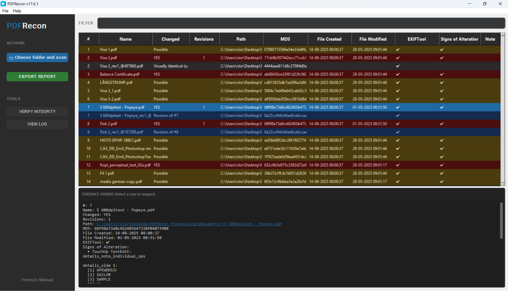

<p align="center">
  
</p>

<h1 align="center">PDFRecon</h1>
<h3 align="center">PDF Forensic Analysis Tool</h3>

<p align="center">
  <b>Detect alterations, extract revisions, and analyze PDF documents for signs of manipulation</b>
</p>

<p align="center">
  <a href="#features">Features</a> •
  <a href="#indicators">Indicators</a> •
  <a href="#installation">Installation</a> •
  <a href="#usage">Usage</a> •
  <a href="#manual-verification">Manual Verification</a>
</p>

---

## What is PDFRecon?

PDFRecon is a **forensic analysis tool** designed to detect signs of alteration in PDF documents. It scans PDF files for over **40 technical indicators** that reveal editing, manipulation, or hidden content—essential for:

- 🏛️ **Legal proceedings** - Verify authenticity of contracts and evidence
- 💰 **Financial audits** - Detect altered invoices and statements  
- 🎓 **Academic integrity** - Check for modified transcripts and certificates
- 🔍 **Digital forensics** - Comprehensive PDF analysis for investigations
- 🛡️ **Fraud detection** - Identify manipulated documentation

---

## Features

### 🔍 Deep PDF Analysis
PDFRecon examines the internal structure of PDF files to detect forensic indicators that are invisible to normal PDF viewers.

### 📜 Revision Extraction
When a PDF is edited with "Save" instead of "Save As", the previous version remains hidden inside the file. PDFRecon automatically extracts ALL previous versions.

<p align="center">
  <i>Example: A document saved 5 times contains 5 complete versions—PDFRecon extracts them all</i>
</p>

### 📊 Timeline Generation
Creates a chronological view of all timestamps found in metadata, showing when the document was:
- Created
- Modified
- Printed
- Signed
- Accessed

### 🔐 Digital Signature Analysis
- Detects signed documents
- Verifies signature validity
- Identifies modifications made AFTER signing

### 📋 Comprehensive Reports
Export findings to:
- **Excel (.xlsx)** - Full analysis with all indicators
- **CSV** - For data processing
- **JSON** - For programmatic access
- **HTML** - For web viewing

### 💼 Case Management
- Save analysis sessions as `.prc` case files
- Reload cases to continue investigation
- Add notes to individual files
- Verify file integrity with MD5 hashes

### 📦 Reader Export
Create self-contained analysis packages that can be shared with colleagues who don't have PDFRecon installed.

---

## Indicators

PDFRecon detects **40+ forensic indicators** organized by confidence level:

### 🔴 High Confidence (Red Flag)

| Indicator | Description |
|-----------|-------------|
| **TouchUp_TextEdit** | Adobe Acrobat's text editing tool leaves this marker when text is manually modified |
| **Has Revisions** | Previous document versions found embedded in the file |
| **JavaScript Auto-Execute** | Scripts configured to run when the document opens |
| **Missing Objects** | References to objects that don't exist (indicates improper editing) |

### 🟡 Medium Confidence (Yellow Flag)

| Indicator | Description |
|-----------|-------------|
| **Multiple Font Subsets** | Same font embedded multiple times (text added at different times) |
| **Multiple Creators/Producers** | File processed by multiple applications |
| **XMP History** | Editing history recorded in metadata |
| **Document ID Mismatch** | IDs don't match (document merged or heavily edited) |
| **Multiple startxref** | Multiple cross-reference tables (incremental saves) |
| **Objects Gen > 0** | Objects were deleted and their numbers reused |
| **White Rectangle Overlay** | White shapes drawn to hide content |
| **Invisible Text** | Text with rendering mode 3 (not displayed) |
| **Date Mismatch** | Creation/modification dates don't match between Info and XMP |
| **Linearized + Updated** | Web-optimized PDF was later modified |
| **Has Redactions** | Document contains redaction annotations |
| **Digital Signature** | Document is signed (broken = modified after signing) |
| ...and 25+ more | See full manual for complete list |

---

## Installation

### Option 1: Download Executable (Recommended)

1. Go to [**Releases**](../../releases)
2. Download `PDFRecon.exe`
3. (Optional) Download ExifTool for enhanced metadata extraction

### Option 2: Run from Source

```bash
# Clone repository
git clone https://github.com/yourusername/PDFRecon.git
cd PDFRecon

# Install dependencies
pip install -r requirements.txt

# Run
python app.py
```

### Option 3: Build Executable

```bash
pip install pyinstaller
pyinstaller PDFRecon.spec
# Output: dist/PDFRecon.exe
```

### ExifTool Integration (Optional but Recommended)

For best results, place these in the same folder as PDFRecon:
- `exiftool.exe`
- `exiftool_files/` folder

Download from: https://exiftool.org/

---

## Usage

### Basic Workflow

1. **Launch PDFRecon**
2. **Click "Choose folder and scan"** - Select a folder containing PDF files
3. **Review results** - Files are color-coded by risk level:
   - 🔴 **Red** = High confidence of alteration
   - 🟡 **Yellow** = Suspicious patterns found
   - 🟢 **Green** = No indicators detected
4. **Click any file** - View detailed indicators in the Inspector panel
5. **Right-click** - Access additional options:
   - View PDF
   - Show Timeline
   - Extract Revisions
   - Visual Comparison
6. **Export Report** - Save findings to Excel/CSV/JSON/HTML

### Inspector Panel

When you select a file, the Inspector shows:
- **Details Tab** - All detected indicators with explanations
- **PDF Tab** - View the document with TouchUp text overlay
- **Version History** - Compare extracted revisions
- **Timeline** - Chronological view of all timestamps

### Keyboard Shortcuts

| Key | Action |
|-----|--------|
| `Ctrl+O` | Open case file |
| `Ctrl+S` | Save case |
| `F5` | Refresh/Rescan |
| `Delete` | Remove selected file from list |

---

## Manual Verification

PDFRecon includes a comprehensive **forensic manual** (Help → Manual) that explains:

### For Each Indicator:
- ✅ What it means forensically
- ✅ Step-by-step hex editor instructions
- ✅ Exact byte patterns to search for
- ✅ How to decode the data
- ✅ Command-line verification methods

### Example: Finding TouchUp_TextEdit Manually

```
1. Open PDF in hex editor (HxD, 010 Editor)
2. Search for: TouchUp_TextEdit
3. Or search hex: 2F 54 6F 75 63 68 55 70
4. Look for /PieceInfo dictionary containing:
   /LastModified (D:20240115143000+01'00')
   /Private << /TouchUp_TextEdit true >>
```

### Useful Commands

```bash
# Decompress PDF for analysis
qpdf --qdf --object-streams=disable input.pdf output.pdf

# Count revisions (%%EOF markers)
grep -c "%%EOF" file.pdf

# Extract all metadata
exiftool -a -G file.pdf

# Check digital signatures
pdfsig file.pdf
```

---

## System Requirements

- **OS:** Windows 10/11
- **RAM:** 4GB minimum, 8GB recommended
- **Disk:** 200MB for application + space for analysis

### For Running from Source
- Python 3.10 or higher
- Dependencies in `requirements.txt`

---

## Project Structure

```
PDFRecon/
├── app.py                    # Entry point
├── pdfrecon/
│   ├── app_gui.py           # Main GUI (5000+ lines)
│   ├── scanner.py           # Indicator detection
│   ├── advanced_forensics.py # Extended detection
│   ├── pdf_processor.py     # PDF utilities
│   ├── exporter.py          # Report generation
│   └── utils.py             # Helpers
├── lang/
│   ├── translations.json    # EN/DA translations
│   ├── manual_en.md         # English manual
│   └── manual_da.md         # Danish manual
├── assets/                  # Screenshots, icons
├── PDFRecon.spec           # PyInstaller config
└── requirements.txt        # Dependencies
```

---

## Changelog

### v17.3.5 (Current)
- ✨ Comprehensive forensic manual with parsing instructions
- ✨ TouchUp text extraction with per-page display
- ✨ Related document detection via XMP IDs
- ✨ Version history with visual diff
- 🐛 Fixed case loading errors
- 🐛 Fixed restricted environment support

### v17.3.0
- ✨ 40+ forensic indicators
- ✨ Advanced detection methods
- ✨ Polyglot file detection
- ✨ Image forensics (EXIF in embedded images)

---

## License

PDFRecon is provided for forensic and educational purposes.

This software includes **ExifTool** by Phil Harvey, distributed under the Artistic/GPL license.

See [license.txt](license.txt) for full license information.

---

## Author

**Rasmus Riis**  
📧 riisras@gmail.com

---

## Acknowledgments

- [ExifTool](https://exiftool.org/) by Phil Harvey
- [PyMuPDF](https://pymupdf.readthedocs.io/)
- [CustomTkinter](https://github.com/TomSchimansky/CustomTkinter)

---

## ⚠️ Disclaimer

PDFRecon is a forensic **analysis** tool. The presence of indicators does **not** constitute proof of malicious intent—many indicators can result from legitimate editing operations (form filling, digital signing, normal saves).

**Always combine automated analysis with:**
- Manual verification
- Expert judgment
- Context about document origin

---

<p align="center">
  <b>Found PDFRecon useful? Give it a ⭐ on GitHub!</b>
</p>
