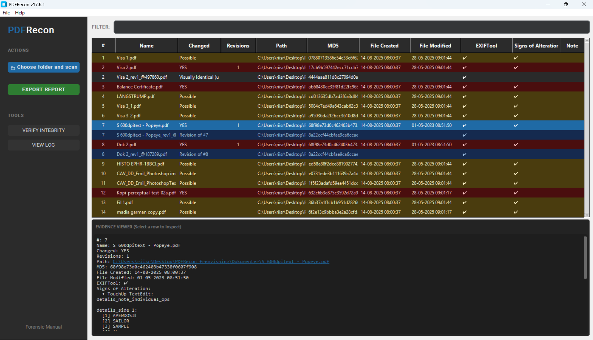
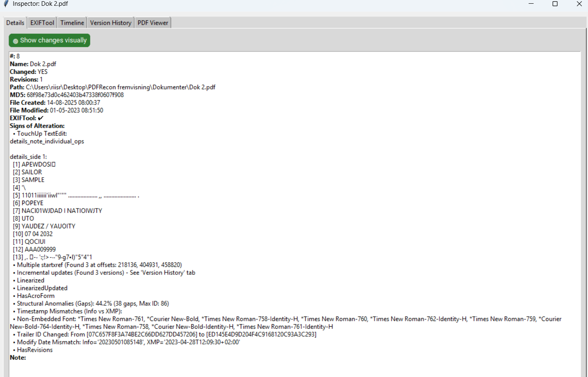
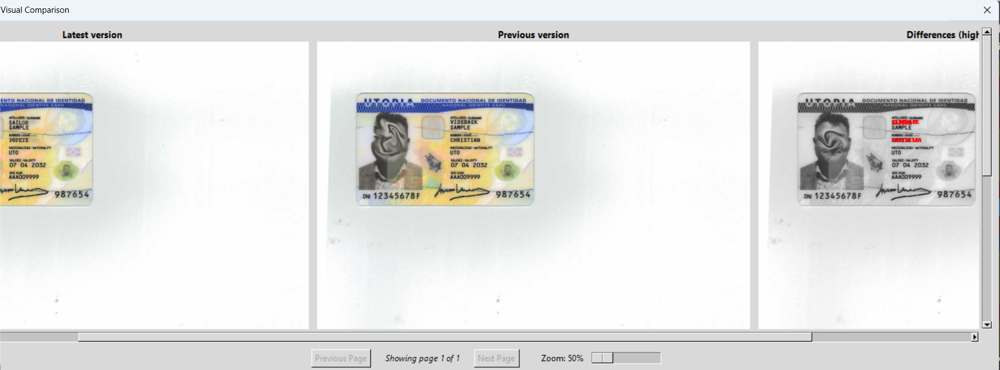
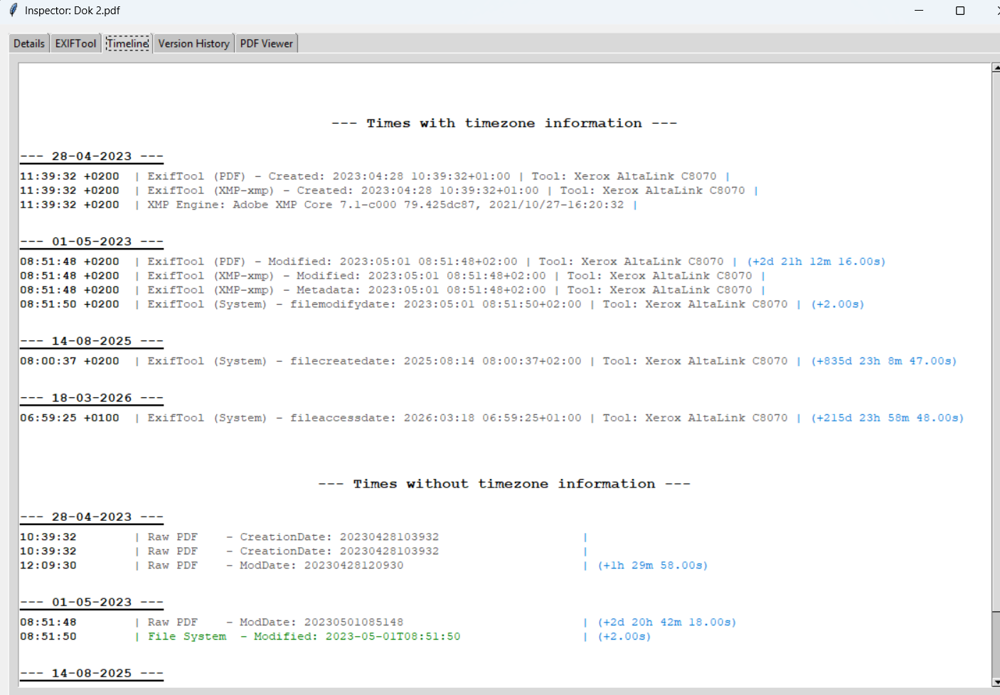
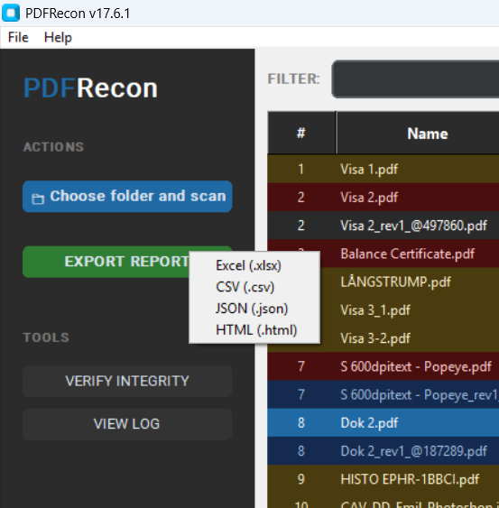
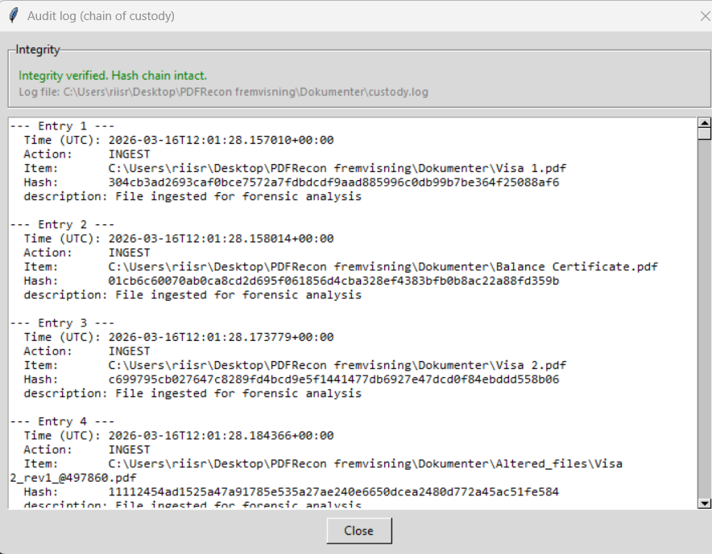

<div align="center">

<!-- PLACEHOLDER: Hero / header image (e.g. app logo + tagline). Suggested size: ~860px wide -->


# PDFRecon

### PDF Forensic Analysis Tool

**Detect alterations, extract revisions, and analyze PDF documents with 40+ forensic indicators**

[Features](#features) • [Screenshots](#screenshots--demo) • [Installation](#installation) • [Quickstart](#quickstart) • [CLI](#cli) • [Manual](#forensic-manual)

</div>

---

## Overview

PDFRecon is a **forensic analysis tool** for detecting signs of alteration in PDF documents. It scans PDFs for **40+ technical indicators** that reveal editing, manipulation, hidden content, and post‑signing changes. It supports case management, chain of custody, exports with sidecar signing, and visual/text diffing of revisions.

**Use cases:** Legal & evidence authenticity • Audits & fraud detection • Digital forensics • Academic verifications

---

## Features

- **Deep PDF inspection** — 40+ indicators (TouchUp edits, revisions, hidden/invisible text, overlays, JavaScript, XMP history, PDF/A violations, etc.)
- **Case management** — Save/load `.prc` cases, add notes, verify integrity (hashes)
- **Exports** — Excel, CSV, JSON, HTML + sidecar SHA‑256 and optional detached signature for all exports
- **Chain of custody** — Automated, tamper‑evident logging
- **Revision extraction & comparison** — Text diff and visual diff
- **Image forensics** — ELA overlays, JPEG fingerprint anomalies, duplicate images
- **Powerful GUI** — Inspector, Timeline, PDF Viewer overlays, version history
- **CLI** — Batch scanning, signed report export, JavaScript extraction

---

## Screenshots / Demo

Replace the placeholders below with your own images. Suggested sizes: ~600–800px wide for consistency.

| Main window – scan results | Inspector – details & PDF viewer | Visual diff (revision vs final) |
|:--------------------------:|:--------------------------------:|:-------------------------------:|
|  |  |  |

| Timeline | Export (Excel) | Chain of custody / audit log |
|:-------:|:--------------:|:-----------------------------:|
|  |  |  |

**Placeholder files to add under `assets/`:**
- `PLACEHOLDER_HEADER.png` — Hero/header image
- `PLACEHOLDER_OVERVIEW.png` — Main GUI with file list
- `PLACEHOLDER_INSPECTOR.png` — Inspector with Details/PDF Viewer
- `PLACEHOLDER_VISUAL_DIFF.png` — Visual comparison window
- `PLACEHOLDER_TIMELINE.png` — Timeline view
- `PLACEHOLDER_EXPORT.png` — Export menu or Excel output
- `PLACEHOLDER_CUSTODY.png` — Audit/custody log
- `PLACEHOLDER_FOOTER.png` — Optional footer banner

---

## Installation

### Option A — Download executable (recommended)

1. Go to [**Releases**](https://github.com/Rasmus-Riis/PDFRecon/releases)
2. Download `PDFRecon.exe`
3. (Optional) Place `exiftool.exe` and `exiftool_files/` next to the exe for better metadata extraction

### Option B — Run from source

```bash
git clone https://github.com/Rasmus-Riis/PDFRecon.git
cd PDFRecon
pip install -r requirements.txt
python app.py
```

### Option C — Build executable

```bash
pip install pyinstaller
pyinstaller PDFRecon.spec
# Output: dist/PDFRecon.exe
```

> **ExifTool** (optional): [exiftool.org](https://exiftool.org/)

---

## Quickstart

1. Launch PDFRecon
2. Click **“Choose folder and scan”** → select a folder with PDFs
3. Review the table (red = high risk, yellow = indications, green = clean)
4. Select a file → **Inspector** shows indicators, timeline, PDF overlays, revisions
5. **File → Save Case As…** to store a `.prc` case
6. **Export Report** → Excel / CSV / JSON / HTML (with sidecar hash/signature)
7. **File → Verify integrity** (when a case is loaded) to re‑hash evidence files

**Tips:** Arrow keys move selection; right‑click for PDF, Timeline, Visual Diff, Note. Inspector’s PDF Viewer can overlay ELA, JPEG, TouchUp, and duplicate‑image findings.

---

## CLI

```bash
# Version
python cli.py --version

# Scan directory → .prc case + custody log
python cli.py scan C:\Evidence\PDFs
python cli.py scan C:\Evidence\PDFs --output-dir C:\Cases -j 4
python cli.py scan C:\Evidence\PDFs --custody-log C:\Cases\custody.log

# Export signed report from a case
python cli.py export-signed C:\Cases\case_cli_20250101_120000.prc
python cli.py export-signed case.prc --output report.json --custody --sign-key key.pem

# Extract embedded JavaScript from a PDF
python cli.py extract-js suspicious.pdf
python cli.py extract-js suspicious.pdf --output scripts.txt
```

---

## Forensic Manual

- **In app:** Help → Manual (full HTML manual, EN/DA)
- **Markdown:** `lang/manual_en.md`, `lang/manual_da.md`

The manual explains each indicator and how to verify findings with hex editors and CLI tools (qpdf, mutool, exiftool, pdfsig, etc.).

---

## Indicators (examples)

**High confidence (red):** TouchUp_TextEdit • Has Revisions • JavaScript Auto‑Execute • Dangling References • Structural Scrubbing • PDF/A Violation • Timestamp Spoofing • Phishing Directives

**Indications (yellow):** Multiple Font Subsets • Multiple Creators/Producers • XMP History / Gaps • Document ID Mismatch • Multiple startxref • Objects Gen > 0 • White Rectangle Overlay • Invisible Text • Date Mismatch • Linearized + Updated • Has Redactions • Digital Signature • Duplicate Images • Images with EXIF • JPEG Fingerprints • ELA • Excessive Drawing Ops • Orphaned/Missing Objects • Bookmark anomalies • …

See the manual for the full list and verification steps.

---

## Exports, signing & custody

- **Exports:** Excel (.xlsx), CSV, JSON, HTML
- **Sidecar signing:** SHA‑256 `.sha256` file + optional detached `.sig` for all exports
- **Chain of custody:** Ingestion, export events, integrity checks

---

## System requirements

- **OS:** Windows 10/11
- **RAM:** 4 GB minimum, 8 GB recommended
- **From source:** Python 3.10+, dependencies in `requirements.txt`

---

## License

PDFRecon is provided for forensic and educational purposes. Third‑party tools (e.g. ExifTool) have their own licenses. See [license.txt](license.txt).

---

## Author

**Rasmus Riis** — riisras@gmail.com

---

## Acknowledgments

- [ExifTool](https://exiftool.org/) — Phil Harvey
- [PyMuPDF](https://pymupdf.readthedocs.io/)
- [CustomTkinter](https://github.com/TomSchimansky/CustomTkinter)

---

## Disclaimer

PDFRecon is a forensic **analysis** tool. Indicators do **not** prove malicious intent; many stem from legitimate use (form filling, signing, normal saves). Always combine with manual verification and context.

---

<div align="center">

<!-- PLACEHOLDER: Optional footer banner. Suggested width: ~720px -->


**If PDFRecon is useful to you, consider giving the repo a ⭐**

</div>
